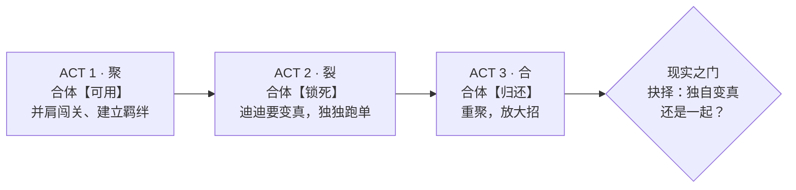
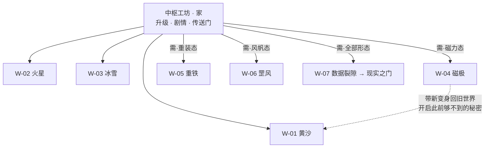
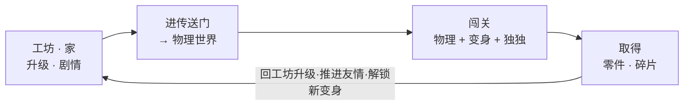

# 《迪迪想变成真的》游戏设计框架 v0.1

> **名字待定**：《迪迪想变成真的》/《BB想变成真的》（迪迪 ＝ BB-8 ＝ bb）。
> 世界观：**bb 和独独的平行宇宙**。定了名字全局替换即可。

一个关于「**变成真的**」的物理多元宇宙温情冒险。迪迪是一段仿真，它想跨过屏幕、变成一台真正能被抱起来的机器人——为此，它和胆小的独独一起，穿过一道道物理法则各异的**平行宇宙之门**。

---

## 1. 三根设计支柱

拿不准任何设计时，回来对这三根柱子。

| 支柱 | 内容 |
| --- | --- |
| **物理即世界** | 每个世界是一条可玩的物理法则（重力、摩擦、磁力、风）。同一身手，换个世界就得重新学怎么开。不是换皮，是换手感。 |
| **友情的裂与合** | 迪迪想变真，独独怕它一变真就离开。一个想改变，一个怕失去——这道裂痕推动整场冒险，也决定结局。 |
| **仿真长成真机** | 这是一台数字孪生。游戏里迪迪一步步装配自己，对应现实里造真机的每一步。玩游戏，就是在造机器人。 |

---

## 2. 故事：一条线的三层

三个故事想法不用选——它们是同一个故事的三层。

- **愿 · Desire —— 变成真的**：迪迪想跨出仿真、变成能被摸到的真机。一切行动的驱动力。
- **路 · Journey —— 修补多元宇宙**：穿过一道道平行宇宙之门，走过一个个物理世界，把破碎的多元宇宙缝回来。
- **心 · Heart —— 迪迪与独独**：两只小机器人的羁绊，聚 → 裂 → 合。玩家真正记住的东西。

> **核心洞察 · 愿望与裂痕同源**
> 迪迪越接近「变成真的」，独独越怕失去它。所以**「变成真的」和「友情破裂修复」是同一条线的两面**——愿望制造裂痕，修补关系才能走向结局。三层，一条线。

---

## 3. 情感结构：三幕（聚 · 裂 · 合）

把「破裂与修复」做成能**亲手感觉到**的机制：合体能力随友情起落而开、锁、还。

- **ACT 1 · 聚**：迪迪与独独并肩闯前几个世界，学会一起玩、一起合体。轻松、建立羁绊。
- **ACT 2 · 裂**：迪迪收集真身零件、越来越接近「变真」；独独发觉它要离开，闹脾气跑单。**合体被锁**，双人机关变成孤身硬闯。
- **ACT 3 · 合**：在最后的「现实之门」前，迪迪面临抉择——独自变真抛下独独，还是找到「一起」的答案。合体归还，情感收束。

---

## 4. 角色

| 角色 | 定位 | 设定 |
| --- | --- | --- |
| **迪迪**（bb） | 主角 · 球形驱动 | 会滚、会爬、磁头能吸金属；表情丰富（好奇/兴奋/点头/受惊）。勇敢又好奇，一心想变成真的。也最容易冲动——摔狠了头会掉。 |
| **独独** | 伙伴 · 独轮侦察 | 胆小的独轮小跟班，钻得进迪迪进不去的窄缝。一害怕就走不动——得用表情哄它。它舍不得迪迪变真，是全场的情感锚。 |

---

## 5. 七个物理生态世界

每个世界 = 一条物理法则 + 一种可带走的变身 + 一份克制的**神韵致敬**（只取味道，不照搬）。

| 编号 | 世界 | 物理法则 | 解锁变身 | 招牌玩法 | 神韵致敬 |
| --- | --- | --- | --- | --- | --- |
| W-01 | 黄沙黄昏 | 正常重力（基准） | 基础滚动 | 学滚动、爬沙丘、找回家的路 | 开阔沙海第一口自由 |
| W-02 | 火星银河夜 | 低重力 3.71 | 🎈 轻盈态·滑翔高跳 | 借沙丘起跳、空中微操、长滞空 | 银河星球跳跃 |
| W-03 | 低重力冰雪 | 低重力 + 冰面无摩擦 | ⛸ 冰刃态·高速滑行 | 停不下来，靠预判走线、惯性过弯 | 滚球漂移竞速 |
| W-04 · 招牌 | 磁极金属城 | 磁力主导 | 🧲 磁力态·吸墙吸顶 | 磁头贴金属面攀爬、磁极推拉谜题 | 传送门式机关脑洞 |
| W-05 | 重铁深渊 | 高重力 | 🔨 重装态·碾压砸开 | 什么都推不动，靠配重与节奏 | 力量/重力解谜 |
| W-06 | 罡风高原 | 持续侧向风 | ⛵ 风帆态·御风远航 | 风把你吹偏，逆风推进、借风滑翔 | 御风而行的诗意 |
| W-07 · 终局 | 数据裂隙 | 物理会「抽风」 | ❓ 破格态·打破规则 | 规则每几秒突变——因为这是仿真！通往现实之门 | glitch / 时空错乱元叙事 |

### 世界与能力门（非线性回溯）

新变身当「钥匙」，让你回旧世界打开此前够不到的路——温情银河城式结构。

---

## 6. 变身 & 合体：把一切拧成一股的核心系统

「变身」一口气解决了**进度、致敬、友情**三件事。

- **变身 = 可携带的物理法则**：每通一个世界，迪迪学会那条法则的「形态」，带去别处用。磁极学到的磁力态，回冰雪世界能吸住金属绕过冰面——新能力自然开新路，形成回溯探索。
- **合体 = 友情的机制化身**：羁绊满时迪迪＋独独能合体成大形态解双人谜题。第二幕「裂」时**合体被锁死**，玩家亲手感到友情断了；第三幕修复，合体归还、放大招。情感有了牙齿。
- **切换 = 手感即玩法**：变身不是数值升级，是换一套物理手感。同一个操作，轻盈态飘、重装态沉、冰刃态滑——肌肉记忆要跟着世界重学。这正是支柱一。

---

## 7. 核心循环

三层循环：**手感**（每一秒的滚动）→ **关卡**（一趟世界之旅）→ **成长**（变身与剧情推进）。

---

## 8. 系统清单

- **🧲 磁吸头（招牌）**：贴金属面攀爬、磁极推拉谜题。而且**摔狠了头会真的掉**——正是造真机最怕的事——得滚回去捡；无头的迪迪看不见、不会叫。把工程恐惧变成机制。
- **🐤 独独伙伴 AI**：跟随 / 召唤 / 护送 / 合体四态（跟随与操控已有基础）。钻窄缝、按机关、需要被保护。
- **😀 表情即机制**：独独害怕就走不动，迪迪用「好奇 / 点头 / 叫一声」哄它前进。表情从装饰升级成解谜工具。
- **🔩 收集物**：真身零件（推进「变真」与升级）＋ 宇宙碎片（修补世界、解门）＋ 可选彩蛋。
- **🛠 工坊升级树**：装磁铁、加配重、调电机——升级即解锁变身与能力门，顺序照着真机装配走。
- **💾 存档与成绩**：世界进度、变身解锁、每世界最佳（沿用现有 localStorage，之后可换云存）。

---

## 9. 关卡与谜题范式（可复用积木）

不用每关重新发明——用这几种范式组合出无数关卡。

- **借力起跳**：用沙丘/斜面把动量转成高度（低重力世界放大）。
- **磁吸攀爬**：金属面 = 可行走的「路」，规划贴附路线绕过地面障碍。
- **护送独独**：带胆小的独独穿过它害怕的险段，一路哄、一路清障。
- **双人合体机关**：需要合体大形态才能推动/触发——第二幕被剥夺，制造张力。
- **逆风 / 高重力推进**：外力与你作对，考节奏与蓄力。
- **规则突变**：数据裂隙里物理每几秒变一次，逼玩家临场切变身。

---

## 10. 与真机的对应（玩游戏 = 造机器人）

别人做不出来的钩子：迪迪在游戏里每次升级，都映射现实里造真机的一步。

| 游戏里 | 现实里 | 阶段 |
| --- | --- | --- |
| 磁力态·头吸得更牢 | 换更强 N52 磁铁 / 减壁厚 | 真机 阶段3 |
| 基础滚动调优 | 底盘双轮 + 配重走直线 | 真机 阶段4 |
| 重装态·更大扭矩 | 升级电机 / 驱动（TB6612） | 真机 阶段4 |
| 手感校准 | 实测摩擦/延迟回填仿真 | 真机 阶段5 |
| 变成真的（终局） | 连上 ESP32、屏幕内外同动 | 真机 阶段6 |

现有的 `ControlState` 指令桥（drive / turn / lookYaw / lookPitch / emote）一路不变——所以「变成真的」不是比喻，是真能连上真机的终局关。

---

## 11. 路线图

先做「麻雀虽小五脏俱全」的纵向切片跑通闭环，再一层层加世界。

| 阶段 | 内容 |
| --- | --- |
| **切片 · NOW** | 一条能玩通的最小闭环：工坊 → 进 1 道门 → 在 1 个物理世界用 1 种变身、带着独独闯到终点 → 回工坊解锁下一形态。复用现有物理、`universes.ts`、`race.ts` 活动骨架。 |
| P1 世界扩张 | 现有 3 宇宙升级成世界，补齐 W-04~W-07，每世界配一种变身与一组谜题范式。 |
| P2 情感主线 | 接上三幕（聚/裂/合），合体系统 + 独独 AI 完整化，工坊剧情节点。 |
| P3 打磨 | 追尾相机、音效、表情演出、收集与成就；「穿越赛」并入世界作为一种活动。 |
| P4 变成真的 | 终局关连接真机（ESP32 串口/蓝牙），屏幕内外同动——数字孪生闭环。 |

---

## 12. 技术架构（对接现有代码）

- **`universes.ts` → 世界/物理档案**：现有「重力+摩擦+抓地」扩展成每个世界的完整物理法则（加磁力、风力等力场）。
- **`ControlState` + 变身修饰层**：变身 = 在同一套指令上叠一层物理修饰（力/阻尼/新交互），仿真与真机共用不变。
- **`race.ts` 模式 → 活动模块**：竞速/护送/收集/谜题都做成同构的「活动」模块，挂进世界。
- **新增**：工坊场景 + 传送门系统、变身/合体状态机、独独伙伴模式机、能力门（进度锁）、存档层。
- **保持不变**：`HardwareAdapter` 硬件桥——终局「变成真的」直接复用，迪迪照样能开真机。

---

*框架到此成形。下一步：先做纵向切片——能从工坊进一道门、在一个物理世界里用一种变身带着独独闯到底。跑通了，整个多元宇宙就能一层层长出来。*
