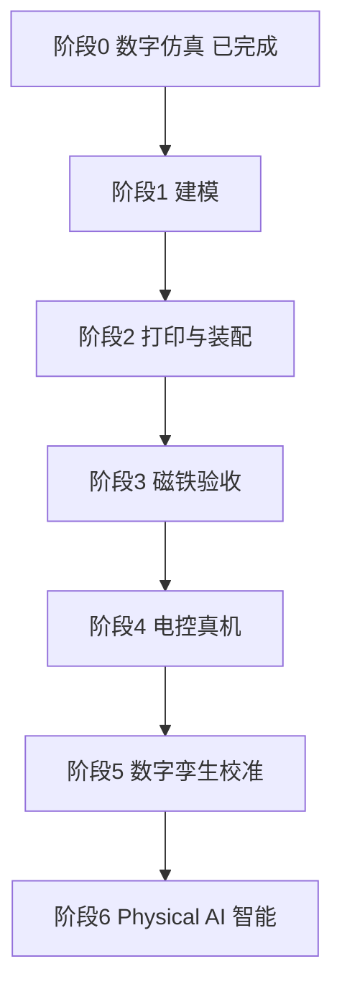

# 智能 BB-8 完整计划

目标：做一台像电影里那样、能听懂话的真实 BB-8。路线是「仿真 → 真机 → 智能」，每个阶段有明确验收，不通过就不进下一步。

---

## 阶段 0：数字仿真（已完成）

已有成果：

- 浏览器里可玩的 BB-8：球体物理滚动、头部磁吸贴合、叫声、性格音效
- 统一控制指令 `drive / turn / lookYaw / lookPitch / emote`，仿真和真机共用
- ESP32 固件草稿 `firmware/bb8_bridge.ino`（串口 115200 + 蓝牙 Nordic UART）
- 真机规格 `docs/hardware-spec.md`（300mm 原型）

运行：`npm run dev`，打开 http://localhost:5173/

---

## 阶段 1：建模（2–4 周）

目标：每个零件都有能打印的 3D 模型（STL/STEP）。

| 零件 | 要点 |
| --- | --- |
| 上下半球 | 外径 300mm，壁 2.5–3mm，对扣沿 + 检修口 |
| 内部底盘 | 电机座 ×2、配重仓、支撑脚轮，占位 90×120×70mm |
| 磁铁桅杆 | 顶端放 N52 磁铁一圈，同极朝上 |
| 头壳 | 外径 175mm（电影比例 0.58×球径），壁 2mm，底部带座圈和收口锥台 |
| 头底磁铁座 + 舵机架 | 偏航 ±40°、俯仰 ±20°，万向滑动不粘死 |

软件：Fusion 360（推荐，教程多）或 FreeCAD。AMD 显卡完全够。

不会画的捷径：买现成 300mm 空心球，只画底盘和头座。

验收：所有零件在软件里装进球不打架，壁厚和磁隙符合规格。

---

## 阶段 2：打印与装配（1–3 周）

- 切片：OrcaSlicer / Cura；材料 PETG 或 ABS
- 球壳大件建议外发代打，底盘小件自己打
- 没有打印机：买球 + 代打底盘

验收：两瓣半球能对扣，底盘放得进去，头壳罩得住舵机。

---

## 阶段 3：磁铁验收（几天，最关键）

只装磁铁，不通电、不装轮子：

- 球内桅杆顶部一圈 N52（20×5mm，4–6 片，同极朝上）
- 头底一圈 N52（异极朝下）
- 隔 3mm 球壁，磁隙 3–5mm

验收：手推球滚 2–3 米，头跟着滑、不掉、不转到脑后。
**这步不过，绝不装电机。** 失败就加磁铁数量或减壁厚。

---

## 阶段 4：电控真机（2–4 周）

按顺序做，每步单独验收：

1. 底盘双轮 + 配重装进球（不装头），USB 供电，串口只发 `drive` → 球能走直线、能停
2. 加 `turn` → 能转向
3. 装头和两个舵机（MG90S ×2）→ 头能看左右上下，限位 ±40°/±20°
4. ESP32 烧 `firmware/bb8_bridge.ino`，Chrome 打开仿真页面点「连接串口」

验收：键盘 WASD 同时驱动屏幕里和地板上的 BB-8。

电料清单见 `docs/hardware-spec.md`：ESP32、JGA25-370×2、TB6612、MG90S×2、3S 电池+BMS。预算约 800–1500 元。

---

## 阶段 5：数字孪生校准（1–2 周）

把真机实测数据填回仿真：整机重量、地面摩擦、电机响应延迟、最高速度。

验收：仿真里的手感和真机基本一致。此后新功能先在仿真里试，再下发真机。

---

## 阶段 6：Physical AI 智能（后面的活，分三个台阶）

| 台阶 | 做法 | 时间 | 算力需求 |
| --- | --- | --- | --- |
| 听懂话 | 麦克风 → 语音识别（云端 API）→ 解析成「前进/停/看左/叫一声」→ 转成已有指令 | 1–2 周 | AMD 够 |
| 看得见 | 头部装摄像头（ESP32-CAM 或树莓派）→ 识别人和障碍 → 跟人走、避障 | 1–2 月 | AMD 够 |
| 自主行为 | 仿真里用强化学习训练策略（Isaac Lab 等）→ 下发真机（可能要 Jetson） | 半年起 | 需要 NVIDIA 或租云 GPU |

要点：真机上不跑大模型，语音识别走云端；只有台阶 3 的训练才需要强 GPU，**现在不用买**。

---

## 时间与预算总览

| 阶段 | 时间（业余） | 花费 |
| --- | --- | --- |
| 1 建模 | 2–4 周 | 0 |
| 2 打印 | 1–3 周 | 200–600 元 |
| 3 磁铁 | 几天 | 50–150 元 |
| 4 电控 | 2–4 周 | 500–800 元 |
| 5 校准 | 1–2 周 | 0 |
| 6 智能台阶1 | 1–2 周 | 0（云 API 少量费用）|
| 6 智能台阶2 | 1–2 月 | 100–300 元 |
| 6 智能台阶3 | 半年起 | 云 GPU 或 Jetson，到时再说 |

第 1–5 阶段合计约 2–3 个月，1000–1500 元。

## 最容易翻车的三件事

1. 磁铁太弱或球壁太厚 → 头掉（阶段 3 专门挡这个）
2. 配重不够 → 轮子在内壁打滑，球不滚
3. 12V 电机和 5V 舵机共地没处理好 → 一跑就复位

## 小白学习清单（按顺序）

1. Fusion 360 基础建模（一周视频教程）
2. 切片软件 + PETG 打印
3. Arduino/ESP32 入门（会烧固件、会接线就够）
4. 万用表 + 电池安全（3S 锂电）
5. 暂时不学：Isaac、CUDA、ROS2 —— 到阶段 6 台阶 3 再说
